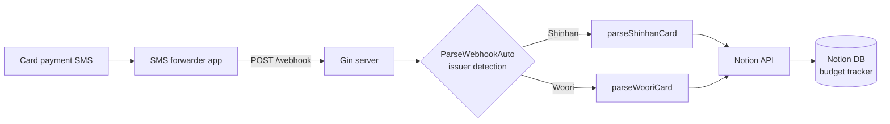

# crow

A webhook server that parses card payment SMS and auto-logs them to a Notion budget tracker.

[](https://github.com/nonasking/crow/actions/workflows/ci.yml)
[](https://codecov.io/gh/nonasking/crow)
[](go.mod)

## Why

Manually adding each card transaction to my Notion budget page got old fast. The payment SMS already carries everything I need — amount, merchant, date — so the natural move is to parse it on arrival and write it straight to Notion.

An SMS forwarder app on my phone POSTs the message to this server. A regex parser dispatches on issuer, extracts the fields, and creates a page via the Notion API. 30~40 manual entries per month, gone.

## Architecture



Three layers, separated by intent:

- `internal/parser` — issuer-specific SMS parsers. Pure functions, no external dependencies.
- `internal/notion` — Notion API client. Maps parsed fields to page properties and POSTs.
- `internal/handler` — Gin handler. Wires the two together.

The handler stays thin so the parser can be unit-tested in isolation.

## Quick start

```bash
cp .env.example .env
# fill in NOTION_TOKEN, NOTION_DATABASE_ID, NOTION_VERSION

go run ./cmd/server
```

Defaults to port `8080`. Override with `PORT`.

Request shape:

```bash
curl -X POST http://localhost:8080/webhook \
  -H "Content-Type: application/json" \
  -d '{"message": "[Web발신]\n1차 민생회복 신한(4557)승인 강*성 16,980원 08/24 17:50 땀땀 잔액 0원"}'
```

## Adding a new card issuer

Three places to touch:

1. Add `parseXxxCard(msg) (...)` in `internal/parser/message_parser.go`
2. Add a switch arm to `ParseWebhookAuto`
3. Add fixture cases to `internal/parser/message_parser_test.go`

The handler and Notion client stay untouched by design.

## Tradeoffs

- **Regex-based parser** — breaks if an issuer changes their SMS format (Shinhan did once, which is why there are dual old/new format branches). Mitigated by accumulating real SMS samples as fixtures in `*_test.go`. CI goes red before production does.
- **Notion as the data store** — zero infra cost. In exchange, throughput is bounded by Notion's rate limit (~3 req/sec average), so concurrent bursts are a non-goal. Fine for personal use.
- **Render free tier deploy** — 5~10s cold start. Hidden inside the natural delay between swiping a card and the SMS arriving, so it's not noticeable.

## Layout

```
cmd/server/        # entry point
internal/
  config/          # .env loading and validation
  constants/       # issuer names, error messages
  handler/         # /webhook handler
  notion/          # Notion API client
  parser/          # issuer-dispatching SMS parser + tests
.github/workflows/ # CI
```

## Testing

```bash
go test ./... -cover
```

Core business logic (the parser) is covered by table-driven tests over real SMS fixtures — happy path and error cases per issuer.
